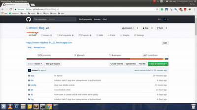

# Pre-work - *Prework - Blog*

**Prework - Blog** is a Ruby on Rails blog application.

Submitted by: **tiendt2311@gmail.com**

Time spent: **10** hours spent in total

URL: **https://warm-reaches-84122.herokuapp.com/**

## User Stories

The following is a list of **required** features of the application you'll build for our Pre-work.

* [x] Users can create, edit, and delete Articles from the database using their Rails application.
* [x] User can create a new Article, formatted using the Markdown language.
* [x] User can see how long ago the Article was created.
* [x] There is one Article that introduces the App Creator with name & picture.
* [x] User see a search form on the Articles page.
* [x] When the User attempts to delete an Article there is an alert modal which asks the User to confirm deletion of that specific Article.
* [x] User can submit a search term to find Articles with titles or body containing search terms.
* [x] User can create, edit, and delete comments on an Article.
* [x] User can navigate the application with a responsive navbar.
      http://materializecss.com/navbar.html
* [x] User can Sign Up, Log In, & Sign Out of our application using the Devise gem.      
* [x] The navbar will be responsive as well as **smart**, showing the user logical options related to authentication.
* [x] Only users that are logged in can create Articles.
* [x] Users can only edit & delete their own Articles.
* [x] User can only edit & delete their own comments.

The following **optional** features are implemented:

* [x] User can see who created the Article.
* [x] User can see how many views an Article has.
* [x] User can see who created the Comment.
* [ ] User can add "tags" to a Article, and filter Articles by tag.

The following **additional** features are implemented:
*User can like article and comment

## Video Walkthrough 

[Full Video](https://youtu.be/ivJdpNRnRc8)
GIF created with [Makeagif](http://makeagif.com).

## Notes

I don't know how to create video walkthrough

## License

    Copyright [2017]  [The Tien](https://github.com/dthtien)
